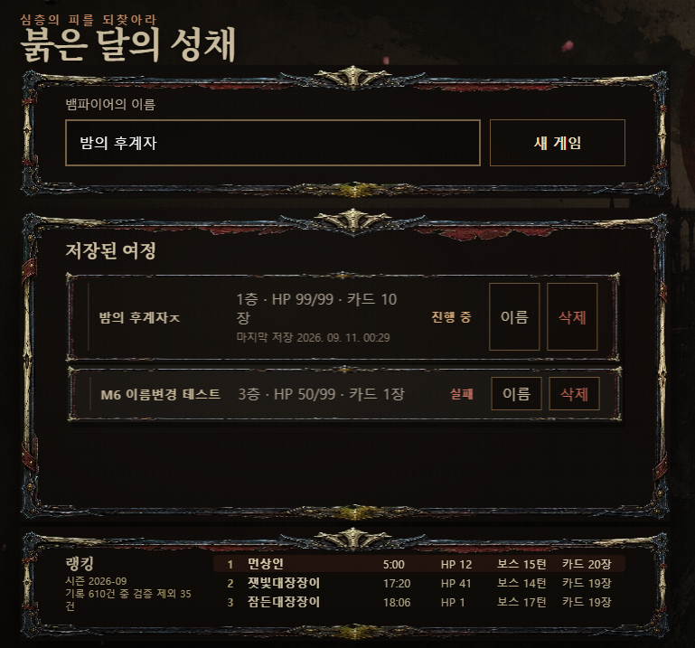
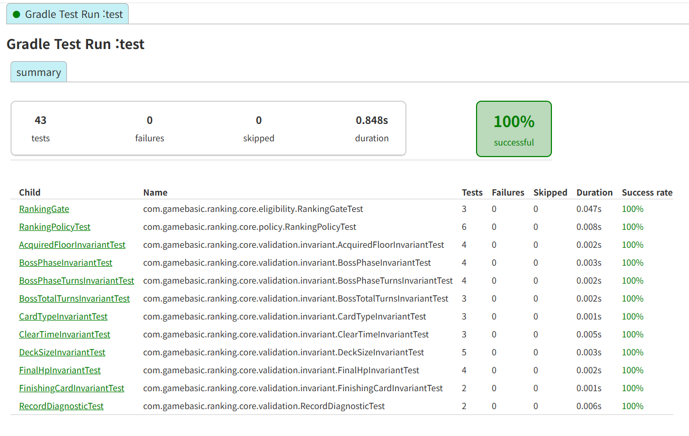
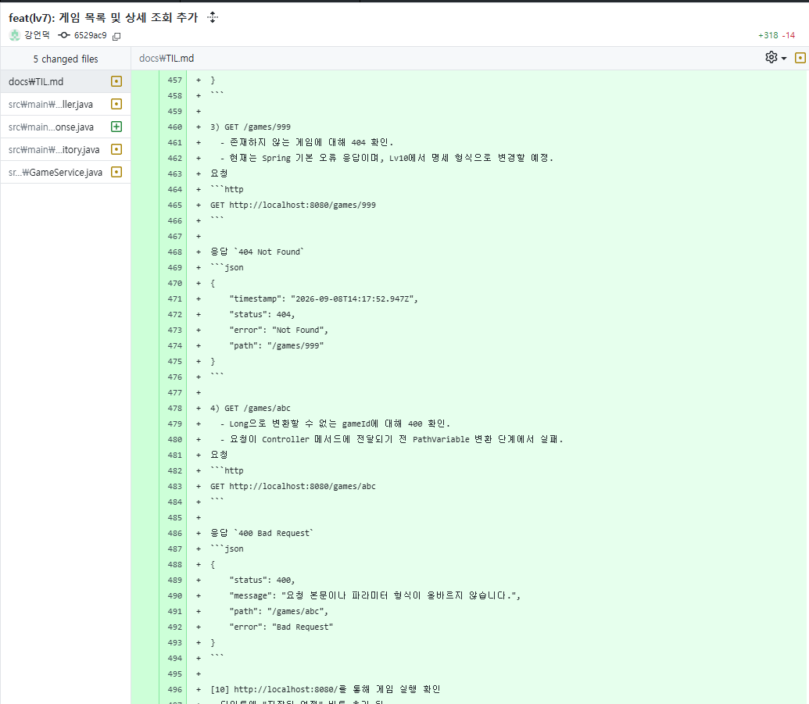
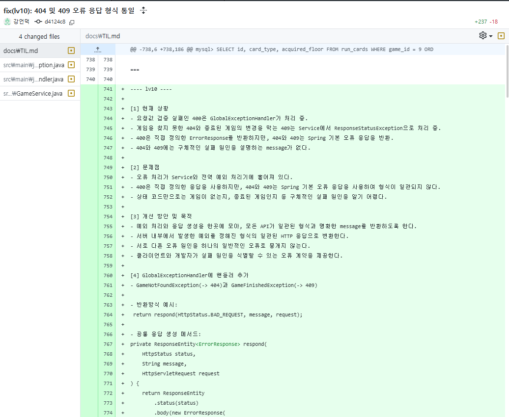

# Crimson Citadel — Spring 백엔드 학습 프로젝트

## Lv12: 외부 시즌 랭킹

### Ranking 시스템의 책임
1. 외부 랭킹 JSON
- 믿을 수 없는 표현 층의 데이터

2. RankingClient
- 외부 랭킹 API에 HTTP 요청
- JSON을 RankingSource 객체로 역직렬화

3. RankingSource
- 랭킹 판정과 응답 구성에 필요한 필드를 받는 DTO
- 외부 JSON 필드 이름과 구조를 그대로 표현.

4. RankingSourceMapper
- Ranking 시스템 내부 언어로 번역
- 값을 보정하지 않음
- 외부 데이터의 이상 여부를 판정하지 않음

5. RankingRecord
- 번역된 채 판정을 기다리는 후보군

6. Gate
- 랭킹 참가 자격 판정
- NOT_ELIGIBLE / 검사 대상 구분

7. RecordInvariant
- 참가 대상 기록이 만족해야 하는 정상 조건
- 시간, HP, 덱, 카드, 보스전 일관성

8. RecordDiagnostic
- 등록된 RecordInvariant를 순서대로 실행
- 최초 위반 사유를 RecordVerdict로 반환
- 모든 검사를 통과하면 VALID

9. RankingPolicy
- 판정 결과에 따라 랭킹 대상 기록 선별
- 정상 기록 정렬
- 플레이어별 최고 기록만 유지

10. RankingService
- 외부 랭킹 조회부터 정책 적용까지 전체 흐름 조정
- 최종 결과를 RankingResponse로 변환

### 요청 흐름

GET /rankings  
        ↓  
RankingController.getRankings()  
        ↓  
RankingService.getRankings()  
        ↓  
RankingClient.fetch()  
        ↓  
RankingSource  
        ↓  
RankingSourceMapper.mapRecords()  
        ↓  
List"RankingRecord"  
        ↓  
RankingPolicy.screen()  
    ├─ Gate  
    ├─ RecordDiagnostic  
    │   └─ RecordInvariant...  
    ├─ 정상 기록 선별  
    ├─ 정렬  
    └─ 플레이어 중복 제거  
        ↓  
RankingScreeningResult  
        ↓  
RankingResponse  
        ↓  
200 OK  

### 현재 적용된 Invariant

검사는 아래 순서대로 실행되며, 처음 발견된 위반 결과를 반환함.

1. `ClearTimeInvariant`
   - 클리어 시간이 층당 최소 30초 이상인지 검사

2. `FinalHpInvariant`
   - 최종 HP가 1~99 범위인지 검사

3. `DeckSizeInvariant`
   - 실제 덱 크기가 9~20인지 검사
   - 선언된 덱 크기와 실제 카드 수가 같은지 검사

4. `CardTypeInvariant`
   - 모든 카드가 허용된 카드 타입인지 검사

5. `AcquiredFloorInvariant`
   - 카드 획득 층이 0~9 범위인지 검사

6. `BossPhaseInvariant`
   - 보스 페이즈가 `THRONE → UNBOUND → ECLIPSE` 순서인지 검사

7. `BossPhaseTurnsInvariant`
   - 각 보스 페이즈의 턴 수가 1 이상인지 검사

8. `BossTotalTurnsInvariant`
   - 선언된 보스 총 턴 수와 각 페이즈 턴 수의 합이 같은지 검사

9. `FinishingCardInvariant`
   - 보스 마무리 카드가 최종 덱에 존재하는지 검사

### Invariant 추가 방법

1. 새로운 INVALID_* 를 `RecordVerdict`에 추가
2. `RecordInvariant`를 구현하는 클래스 작성
3. `evaluate()`에서 정상일 경우 `VALID`, 위반이면 해당 실패 사유 반환
4. `RankingService.createRankingPolicy()`의 `RecordDiagnostic` 목록에 등록
5. 정상·경계값·위반 기록에 대한 단위 테스트 추가

`RecordDiagnostic`은 처음 발견한 위반 결과를 반환하므로, Invariant 등록 순서가 판정 우선순위가 됨.

### 참고

(1)
- Gate 검사(랭킹 참가 대상인지 분류) 이후의 RankingRecord는 판정에 필요한 필수 값이 존재한다고 가정.
- `bossFight`는 랭킹 참가 대상이 아닌 기록에서는 null일 수 있음.
- Gate가 참가 대상 여부를 먼저 판단하므로, 해당 기록에는 Invariant 검사를 실행하지 않음.
(bossFight는 예외적으로 정상 기록에서도 null 가능)

- 다만 기록 조작 등으로 필수 값이 누락된 데이터가 들어오면,
 현재 구현에서는 판정 과정 중 예외 발생 가능.
- DTO를 내부 모델로 변환하는 경계에서 구조를 검증하는 방식을 고려 중.

(2)
- 순위별 보상 등은 없다고 가정함.
- RankingPolicy가 순위대로 정렬해 둔 목록 순서대로 `RankingResponse`를 만듬.

(3)
- 테스트 Fixture 필드는 내부 참조가 있으므로 구조 변경 시 순서 유지.

## 관련 문서

- [API 명세](https://f-api.github.io/game-spring-api-docs/basic/api-docs.html)
- [랭킹 요구사항 정리](https://github.com/123456789qwaszx/game-spring-basic-assignment/blob/ranking/docs/Leaderboard_Detailed.md)
- [랭킹 설계 기록](https://github.com/123456789qwaszx/game-spring-basic-assignment/blob/ranking/docs/Leaderboard_TIL.md)
- [학습 기록](https://github.com/123456789qwaszx/game-spring-basic-assignment/blob/ranking/docs/TIL.md)

## 기술 스택

| 구분 | 사용 기술 |
| --- | --- |
| 언어 | Java 21 |
| 프레임워크 | Spring Boot 4.1.0, Spring MVC |
| 데이터 접근 | Spring Data JPA, Hibernate |
| 데이터베이스 | MySQL 8.0 — Docker 실행 |
| 요청 검증 | Jakarta Bean Validation |
| 외부 HTTP 호출 | Spring RestClient |
| 테스트 | JUnit Jupiter, H2 테스트 프로필 |
| 빌드 | Gradle Wrapper 9.5.1 |
| 코드 보조 | Lombok |

## 그 외

### 실행 결과

- 게임 저장 목록과 시즌 랭킹 데이터를 실제 화면에 연동했다.

### Ranking 테스트

- Gate, Policy, Diagnostic과 각 Invariant의 정상·경계·위반 조건을 단위 테스트로 검증했다.

### API 동작 검증

- 기능 구현 후 정상 요청뿐 아니라 404, 잘못된 PathVariable 등의 실패 요청도 직접 확인하고 기록했다.

### 오류 처리 개선

초기에는 400, 404, 409의 오류 처리가 Service와 전역 예외 처리기에 나뉘어 있었고
응답 형식도 일관되지 않았다.

이를 `GlobalExceptionHandler` 중심으로 정리해
API 오류 응답 형식과 책임을 통일했다.

